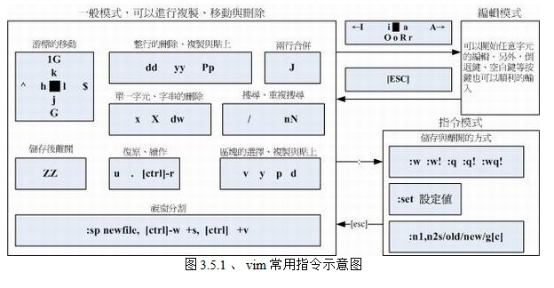
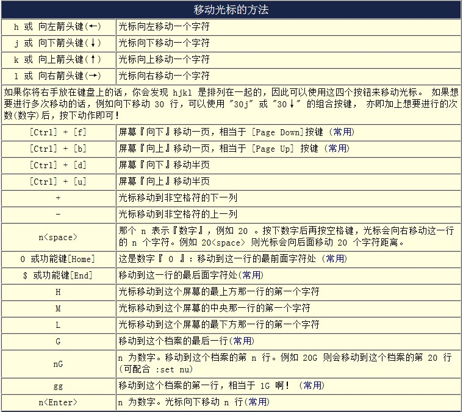
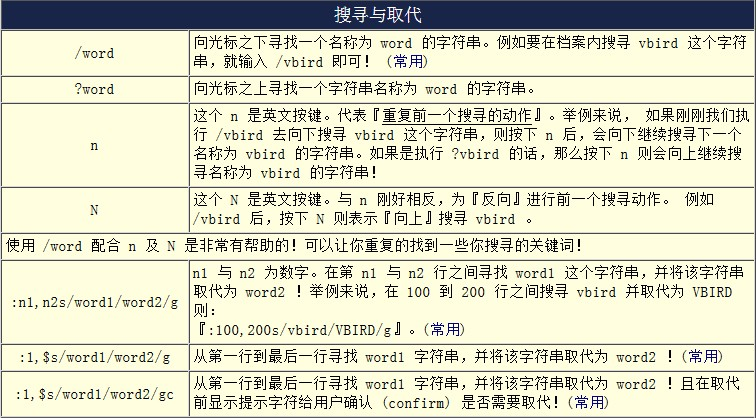
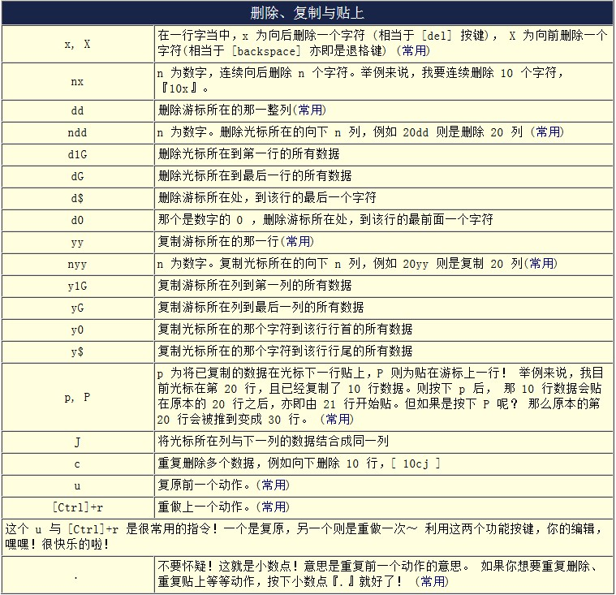
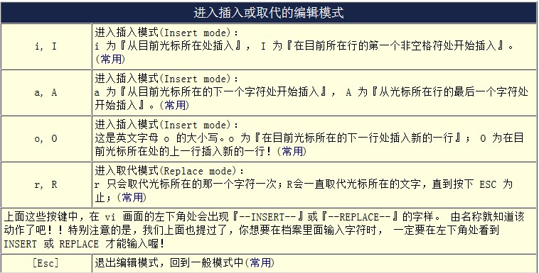
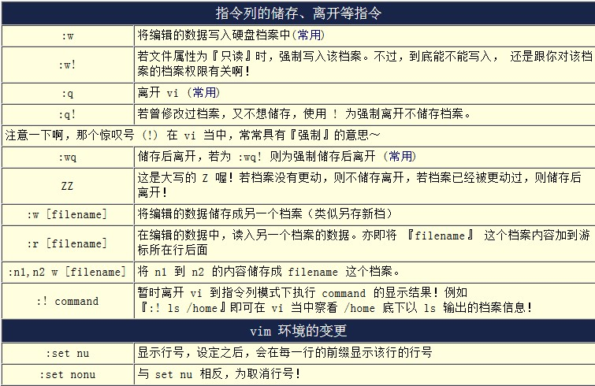

VIM基本操作
============

VIM的三种模式
---------------

## 一般模式：
默认的模式，以VIM新建或打开一个文本文件就直接进入一般模式了。在一般模式下，VIM支持大量的键盘操作，如，通过‘上下左右’键移动光标；通过d，p，y等键盘操作实现基于行的删除，粘贴，复制；通过r或R可以进行字符替换等等。

## 编辑模式：
在一般模式中可以进行删除、复制、贴上等等的动作，但是却无法编辑文件内容的！在一般模式下，通过i, I, o, O, a, A等字符按键可以进入编辑模式。此时，编辑器的最下面的状态栏通常会提示进入“Insert”模式，此时可以进行文档的编辑操作了。编辑完成后，可以通过“ESC”键返回一般模式完成编辑操作。

## 指令列命令模式：
在一般模式下，输入:，/，?三个字符按键，就可以将光标移动到最底下那一行，同时进入命令模式。在模式下，可以实现搜索、字符替换、保存、退出等等一系列的操作。

一般模式可与编辑模式及指令模式切换， 但编辑模式与指令模式之间不可互相切换！VIM编辑器最下面一行是状态行，显示编辑器当前的一些状态信息，如INSERT（编辑器正在编辑模式）等。

VIM基本操作示意图
---------------------

### 基本操作一览

### 移动光标 

### 查找和替换 

### 复制粘贴删除 

### 进入编辑模式

### 进入命令行模式 

